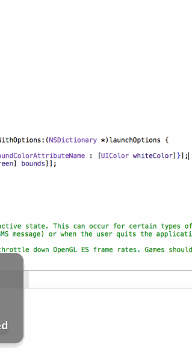

TwiiiwT
=======

A simple Twitter client.

Week 2 Update
-------------

Time spent: 13 hours spent in total

Completed user stories:
 * [x] Required: Hamburger menu: Dragging anywhere in the view should reveal the menu.
 * [x] Required: Hamburger menu: The menu should include links to your profile, the home timeline, and the mentions view.
 * [x] Required: Hamburger menu: The menu can look similar to the LinkedIn menu below or feel free to take liberty with the UI.
 * [x] Required: Profile page: Contains the user header view.
 * [x] Required: Profile page: Contains a section with the users basic stats: # tweets, # following, # followers.
 * [x] Required: Home timeline: Tapping on a user image should bring up that user's profile page.
 
 * [x] Optional: Profile page: Implement the paging view for the user description.
 * [x] Optional: Profile page: Pulling down the profile page should blur and resize the header image.

Walkthrough of all user stories:

 

Time spent: 15 hours spent in total

Completed user stories:
 * [x] Required: User can sign in using OAuth login flow.
 * [x] Required: User can view last 20 tweets from their home timeline.
 * [x] Required: The current signed in user will be persisted across restarts.
 * [x] Required: In the home timeline, user can view tweet with the user profile picture, username, tweet text, and timestamp.
                 In other words, design the custom cell with the proper Auto Layout settings.
                 You will also need to augment the model classes.
 * [x] Required: User can pull to refresh.
 * [x] Required: User can compose a new tweet by tapping on a compose button.
 * [x] Required: User can tap on a tweet to view it, with controls to retweet, favorite, and reply.
 
 * [x] Optional: When composing, you should have a countdown in the upper right for the tweet limit.
 * [x] Optional: After creating a new tweet, a user should be able to view it in the timeline immediately without refetching the timeline from the network.
 * [x] Optional: Retweeting and favoriting should increment the retweet and favorite count.
 * [x] Optional: User should be able to unretweet and unfavorite and should decrement the retweet and favorite count.
 * [x] Optional: Replies should be prefixed with the username and the reply_id should be set when posting the tweet.
 * [x] Optional: User can load more tweets once they reach the bottom of the feed using infinite loading similar to the actual Twitter client.

Walkthrough of all user stories:

GIF created with [LiceCap](http://www.cockos.com/licecap/).

## Acknowledge

This app leverages several third-party libraries:

 * [BDBOAuth1Manager](https://github.com/bdbergeron/BDBOAuth1Manager).

 * FaceBook [POP](https://github.com/facebook/pop).
 
 * [TSMessages](https://github.com/toursprung/TSMessages).

 * [AFNetworking](https://github.com/AFNetworking/AFNetworking).
 
 * [DateTools](https://github.com/MatthewYork/DateTools).
